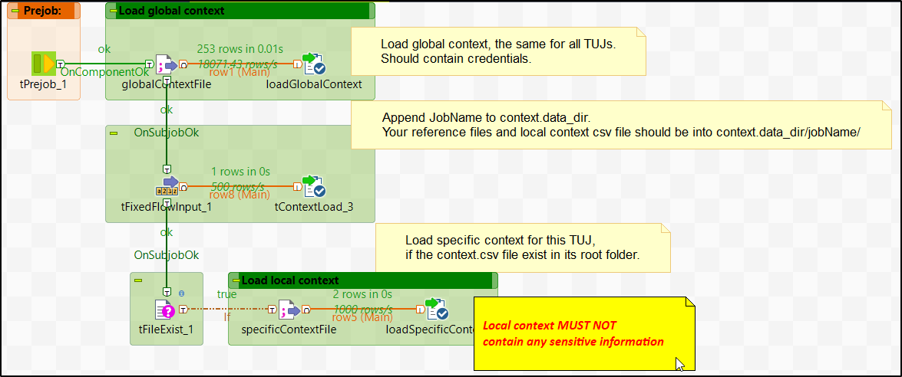
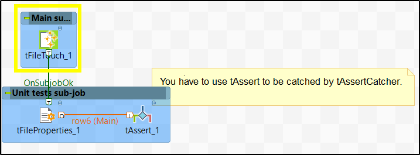
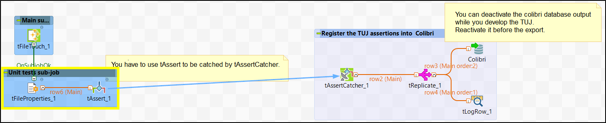
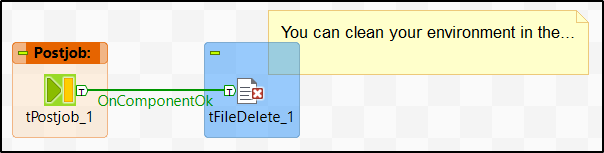

# Test Unit Job description

TUJ is a Talend job that test one facet of one component. It is the unit test for Talend components. TUJs are executed on TTP (Talend Test Platform). There are several TTP environments to test components/studio within different versions of java. Currently we have some: https://tuj.talend.com/ (only 1.7 and 1.8 Oracle are maintened).

## What is it made of ?
A TUJ is mainly composed of 4 parts:
1. Loading context
1. Execution of the component
1. Check the execution with some tests
1. Some cleaning if needed

### Loading context
The tuj-runner gives four context parameter to the job:
1. `param_file_path` : Contains the path to a context file to load
1. `result_table` : This is the table used by the job to store the result of its tests
1. `data_dir` : The folder of the job where it can load some resources; It can also contain a context.csv file to load specific non-credentials context 
1. `data_output_dir` : The folder where the job can store generated files

The main context file to load from `param_file_path`, is `template.csv` file from tuj-config repository. This file contains all TUJs credentials : https://github.com/Talend/tuj-config/blob/tal-rd01/tuj-runner/conf/template.csv

The `tuj-config` repository is a private one. Only critical context variables must be added into `template.csv`, mostly credentials. This file is loaded within the tPreJob.

For other context variables, you can add them into a `context.csv` file into the root folder of your TUJ. It will be loaded too if it exists. Those local context files are created along within the TUJ.

The template context loading is :
1. First it loads the `template.csv` file
1. Then it updates the `data_dir` context variable to set the root of the job
1. Finally, if the local `context.csv` file exists, it is loaded too

_To remember:_
- Critical context keys : into `template.csv` from tuj-config private repository
- Other context : into context.csv in the root folder of the TUJ

### Execution of the component
Once the context is loaded, you have to create a job to test the facet you want of the component. Currently, test environments are shared between all TTPs. So to avoid conflicts, use the available `pid` String variable to identify what you generate. For example, the name of a user you add into a database should be `"name_"+pid`, or the name of a table `"TUJ_TDI12345_mytable_"+pid` and so on...

If it is possible, create a job with only one instance of the component you want to test. Create as many TUJs as you have configuration to test.

Your execution should generate some data to be test in the next section.

The template tests the `tFileTouch` component. You have to remove this component to create your own use case.

_To remember:_
- Only on instance of the component you want to test if possible
- Use `pid` variable
- One TUJ test only one configuration of the main component

### Check the execution with some tests
Once your component has been executed and has generated some data, you have to use tAssert components to validate it. `tAssert` components will be caught by the `tAssertCatcher` which is provided into the template. So, all tests of the TUJ will be registered into the TTP Mysql database. You can have several tAssert in the same TUJ, but it's better to have only one.

The template provides an example of assertion to check if the tfileTouch has well created the file. The sub-job `Register the TUJ assertions into Colibri` should not be edited.

_To remember:_
- Use `tAssert` to test generated data
- All tests are registered into the mysql database of TTP

### Some cleaning if needed
If you have to some cleaning to do, like remove inserted tuple from the database or delete a generated file, you can do it within the tPostJob section.

The template, as cleaning example, delete the file created by the `tFileTouch`. 

_To remember:_
- Post job section is dedicated to cleaning

## How to design my own TUJ ?
To help you to design TUJs, a template has been created.

## Import the template into your studio
At the same level of this `README.md`, you will find the template for TUJ in standard folder. So:
- From your studio, execute `Import items` and select `standard' folder`
- Check `standard_tuj_template` and import it
- Duplicate it to create your own TUJ, so that you can keep the template unchanged and there will not be conflicts with internal id.

- Select a name based on this pattern : `(JIRA_ID)_(component_name)_(use_case)`, examples:
    - TDI34567_tOracleInput_scd_null_values
    - TDI39306_tMicrosoftCrm_WebApp

## how to run the template
The template is a runnable TUJ. If you try to run it, it will fail since:
- The global context file defined by `param_file_path` doesn't exist in your local environment
- Neither the local context file defined by `context.getProperty("data_dir")+"/context.csv"`
You can create them. The first one must contain all context variable except `filename` which is into the local one.

Then configure your TUJ context `param_file_path` with the path to your gobal context file, and copy your local context file into the folder `data_dir + job_name`.

Then, you can  deactivate the `Colibri(tMysqlOutput_1)` component and execute the TUJ.

## How to personalize
To personalize your TUJ:
1. Delete the `Main sub-job` component and create your own sub-job/use case to test your component and generate files to test
1. Delete the `Unit tests sub-job` and add your own assertions
1. Delete the `Main clean sub-job` and add components to do everytime-clean
1. Delete the `Clean if succces sub-job` and add component to do clean if TUJ successful (be carreful to connect this last sub-job with a `trigger/Run if` and set the condition `(Boolean)globalMap.put("TUJ_SUCCESS", Boolean.FALSE)`)

